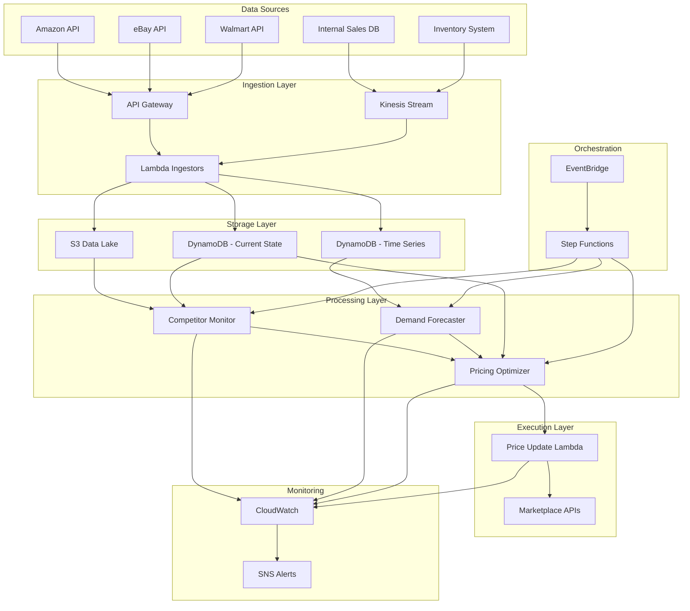

# Design Document: Smart Dynamic Pricing Engine

## Overview

The Smart Dynamic Pricing Engine is a distributed, event-driven system that continuously optimizes product prices across multiple e-commerce platforms. The architecture leverages AWS services for scalability and reliability, with three core agents working in concert: the Competitor Monitor (data collection), the Demand Forecaster (prediction), and the Pricing Optimizer (decision-making). The system processes real-time market signals and applies machine learning models to maximize profit while respecting business constraints.

The engine operates on a continuous feedback loop: market data triggers forecasts, forecasts inform pricing decisions, pricing decisions update marketplaces, and marketplace results feed back into the models. This closed-loop design enables rapid adaptation to market dynamics while maintaining operational safety through rule-based guardrails.

## Architecture

### High-Level System Architecture



### Component Interaction Flow

1. **Data Collection Phase**: Marketplace APIs and internal systems push data through API Gateway or Kinesis
2. **Storage Phase**: Lambda ingestors validate and store data in S3 (historical) and DynamoDB (current state)
3. **Analysis Phase**: EventBridge triggers Step Functions workflow on schedule or data change events
4. **Forecasting Phase**: Demand Forecaster reads time-series data and generates predictions
5. **Optimization Phase**: Pricing Optimizer combines forecasts, competitor data, and constraints to calculate optimal prices
6. **Execution Phase**: Price Update Lambda applies new prices to marketplace APIs
7. **Monitoring Phase**: CloudWatch tracks metrics and SNS sends alerts on anomalies

### AWS Service Mapping

- **Data Ingestion**: API Gateway (REST endpoints), Kinesis Data Streams (real-time events)
- **Compute**: Lambda (serverless functions), ECS Fargate (long-running ML tasks)
- **Storage**: S3 (data lake), DynamoDB (operational data), ElastiCache (caching)
- **ML/AI**: SageMaker (model training), Amazon Forecast (demand prediction), Bedrock (contextual analysis)
- **Orchestration**: Step Functions (workflow), EventBridge (event routing)
- **Monitoring**: CloudWatch (metrics/logs), SNS (notifications), X-Ray (tracing)

## Components and Interfaces

### 1. Competitor Monitor

**Responsibility**: Collect and track competitor pricing and inventory data from multiple marketplace platforms.

**Interface**:
```python
class CompetitorMonitor:
    def collect_competitor_prices(sku: str, platforms: List[str]) -> CompetitorPriceData:
        """
        Collects current competitor prices for a SKU across specified platforms.
        Returns: CompetitorPriceData with prices, timestamps, and availability status
        Raises: DataCollectionError if all platforms fail
        """
    
    def detect_significant_changes(sku: str, threshold_percent: float) -> List[PriceChange]:
        """
        Identifies competitor price changes exceeding the threshold.
        Returns: List of PriceChange objects with old price, new price, platform, timestamp
        """
    
    def get_price_history(sku: str, days: int) -> TimeSeriesData:
        """
        Retrieves historical competitor price data for trend analysis.
        Returns: TimeSeriesData with daily min, max, avg competitor prices
        """
```

**Implementation Details**:
- Uses platform-specific API clients (Amazon SP-API, eBay Trading API, Walmart Marketplace API)
- Implements rate limiting and exponential backoff for API calls
- Caches results in ElastiCache with 5-minute TTL
- Stores raw data in S3 and aggregated data in DynamoDB
- Runs on Lambda triggered by EventBridge (every 15 minutes)

**Error Handling**:
- Platform API failures: Use cached data, log warning, continue with other platforms
- Authentication errors: Alert operators immediately, skip platform
- Rate limit exceeded: Implement exponential backoff up to 5 minutes

### 2. Demand Forecaster

**Responsibility**: Generate demand predictions using time-series models trained on historical sales data.

**Interface**:
```python
class DemandForecaster:
    def generate_forecast(sku: str, horizon_days: int) -> ForecastResult:
        """
        Generates demand forecast for specified horizon.
        Returns: ForecastResult with predicted demand, confidence intervals, accuracy metrics
        """
    
    def calculate_accuracy_metrics(sku: str) -> AccuracyMetrics:
        """
        Calculates MAPE and RMSE by comparing predictions to actual sales.
        Returns: AccuracyMetrics with MAPE, RMSE, and sample size
        """
    
    def retrain_model(sku: str, training_data: TimeSeriesData) -> ModelMetadata:
        """
        Retrains forecast model with updated historical data.
        Returns: ModelMetadata with model version, training date, validation metrics
        """
```

**Implementation Details**:
- Uses Amazon Forecast service with DeepAR+ algorithm for time-series prediction
- Falls back to Prophet or ARIMA for SKUs with limited data
- Trains models weekly using 90 days of historical sales data
- Stores model artifacts in S3 and metadata in DynamoDB
- Runs on ECS Fargate for long-running training jobs
- Inference runs on Lambda for real-time predictions

**Model Selection Logic**:
- SKUs with >90 days of data: DeepAR+ (handles seasonality and trends)
- SKUs with 30-90 days of data: Prophet (simpler, more robust)
- SKUs with <30 days of data: Category-level forecast or similar-product proxy

**Accuracy Monitoring**:
- Calculate MAPE daily by comparing yesterday's forecast to actual sales
- Trigger retraining alert when MAPE exceeds 15% (target: <15% for 85% accuracy)
- Track forecast bias (over-prediction vs under-prediction)

### 3. Inventory Manager

**Responsibility**: Track current stock levels and provide inventory velocity metrics.

**Interface**:
```python
class InventoryManager:
    def get_current_inventory(sku: str) -> InventoryStatus:
        """
        Retrieves current inventory level and status flags.
        Returns: InventoryStatus with quantity, low_stock flag, overstock flag, velocity
        """
    
    def calculate_inventory_velocity(sku: str, days: int) -> float:
        """
        Calculates units sold per day over the specified period.
        Returns: Float representing average daily sales velocity
        """
    
    def update_inventory(sku: str, quantity: int, transaction_type: str) -> bool:
        """
        Updates inventory level for a SKU (sale, restock, adjustment).
        Returns: True if update successful, False otherwise
        """
```

**Implementation Details**:
- Stores current inventory in DynamoDB with SKU as partition key
- Updates triggered by sales events from Kinesis stream
- Calculates velocity using 7-day rolling average
- Low-stock threshold: quantity < (velocity × 7 days × 0.1)
- Overstock threshold: quantity > (velocity × 7 days × 2.0)
- Query latency target: <100ms (DynamoDB single-item read)

### 4. Pricing Optimizer

**Responsibility**: Calculate optimal prices that maximize profit while respecting constraints.

**Interface**:
```python
class PricingOptimizer:
    def calculate_optimal_price(sku: str, context: PricingContext) -> PriceRecommendation:
        """
        Calculates optimal price using profit maximization and constraints.
        Returns: PriceRecommendation with price, expected_profit, confidence, constraints_applied
        """
    
    def estimate_price_elasticity(sku: str) -> ElasticityEstimate:
        """
        Estimates price elasticity coefficient from historical data.
        Returns: ElasticityEstimate with coefficient, confidence_interval, sample_size
        """
    
    def apply_business_rules(price: float, sku: str, rules: BusinessRules) -> float:
        """
        Applies business rule constraints to a calculated price.
        Returns: Adjusted price that complies with all rules
        """
```

**Implementation Details**:
- Runs on Lambda triggered by Step Functions workflow
- Optimization algorithm: Gradient-based search over profit function
- Profit function: `profit(p) = (p - cost) × demand(p)`
- Demand function: `demand(p) = base_demand × (1 + elasticity × (p - current_price) / current_price)`
- Constraint enforcement order: cost floor → MAP policy → competitive ceiling → max change limit

**Price Elasticity Estimation**:
- Uses linear regression on log(demand) vs log(price) from past 90 days
- Filters outliers (sales >3 standard deviations from mean)
- Requires minimum 20 price-demand observations
- Fallback: Use category-average elasticity (stored in configuration)

**Constraint Handling**:
```python
def apply_constraints(price: float, sku: str) -> float:
    # 1. Cost floor
    if price < product_cost:
        price = product_cost
    
    # 2. MAP policy
    if map_policy_exists and price < map_price:
        price = map_price
    
    # 3. Competitive ceiling
    min_competitor_price = get_min_competitor_price(sku)
    if price > min_competitor_price * 1.15:
        price = min_competitor_price * 1.15
    
    # 4. Max change limit
    current_price = get_current_price(sku)
    max_change = current_price * 0.10  # 10% max change
    if abs(price - current_price) > max_change:
        price = current_price + sign(price - current_price) * max_change
    
    return price
```

### 5. Price Update Executor

**Responsibility**: Apply calculated prices to marketplace platforms and validate updates.

**Interface**:
```python
class PriceUpdateExecutor:
    def update_marketplace_price(sku: str, price: float, platforms: List[str]) -> UpdateResult:
        """
        Updates price on specified marketplace platforms.
        Returns: UpdateResult with success status per platform, timestamps, errors
        """
    
    def validate_price_update(sku: str, platform: str, expected_price: float) -> bool:
        """
        Validates that price update was successfully applied.
        Returns: True if marketplace shows expected price, False otherwise
        """
    
    def retry_failed_update(sku: str, price: float, platform: str, attempt: int) -> bool:
        """
        Retries a failed price update with exponential backoff.
        Returns: True if retry successful, False otherwise
        """
```

**Implementation Details**:
- Runs on Lambda triggered by Pricing Optimizer
- Uses platform-specific API clients with retry logic
- Retry strategy: 3 attempts with exponential backoff (1s, 2s, 4s)
- Logs all price changes to DynamoDB audit table
- Validates updates by querying marketplace API after 30-second delay
- Sends SNS alert if all retries fail

### 6. Mock Data Generator

**Responsibility**: Generate realistic synthetic data for testing and demonstration.

**Interface**:
```python
class MockDataGenerator:
    def generate_skus(count: int, categories: List[str]) -> List[SKU]:
        """
        Generates synthetic SKUs with realistic attributes.
        Returns: List of SKU objects with id, name, category, cost, base_price
        """
    
    def generate_sales_history(sku: str, days: int, seasonality: bool) -> TimeSeriesData:
        """
        Generates synthetic sales data with optional seasonal patterns.
        Returns: TimeSeriesData with daily sales quantities and revenue
        """
    
    def generate_competitor_prices(sku: str, days: int, platforms: List[str]) -> CompetitorData:
        """
        Generates synthetic competitor price data with realistic variation.
        Returns: CompetitorData with prices per platform over time
        """
```

**Implementation Details**:
- Uses statistical distributions to generate realistic data
- Sales patterns: Base demand + trend + seasonality + noise
- Seasonality: Weekly (weekend spike) and monthly patterns
- Competitor prices: Correlated with base price ± random variation (5-15%)
- Inventory: Starts at 1000 units, decreases with sales, random restocks
- Clearly marks all generated data with `is_mock: true` flag


## Data Models

### SKU (Product)
```python
{
    "sku_id": "string",           # Unique identifier
    "name": "string",             # Product name
    "category": "string",         # Product category
    "cost": "float",              # Unit cost
    "current_price": "float",     # Current selling price
    "map_price": "float | null",  # Minimum advertised price (if applicable)
    "platforms": ["string"],      # List of marketplace platforms
    "created_at": "timestamp",
    "updated_at": "timestamp"
}
```

### CompetitorPriceData
```python
{
    "sku_id": "string",
    "timestamp": "timestamp",
    "prices": {
        "amazon": "float | null",
        "ebay": "float | null",
        "walmart": "float | null"
    },
    "availability": {
        "amazon": "boolean",
        "ebay": "boolean",
        "walmart": "boolean"
    },
    "min_price": "float",
    "max_price": "float",
    "avg_price": "float"
}
```

### ForecastResult
```python
{
    "sku_id": "string",
    "forecast_date": "timestamp",
    "horizon_days": "int",
    "predictions": [
        {
            "date": "date",
            "predicted_demand": "float",
            "lower_bound": "float",    # 95% confidence interval
            "upper_bound": "float"
        }
    ],
    "model_type": "string",           # "deepar", "prophet", "arima"
    "accuracy_metrics": {
        "mape": "float",
        "rmse": "float"
    }
}
```

### InventoryStatus
```python
{
    "sku_id": "string",
    "quantity": "int",
    "velocity": "float",              # Units per day
    "low_stock": "boolean",
    "overstock": "boolean",
    "last_updated": "timestamp"
}
```

### PriceRecommendation
```python
{
    "sku_id": "string",
    "recommended_price": "float",
    "current_price": "float",
    "expected_demand": "float",
    "expected_profit": "float",
    "confidence": "float",            # 0.0 to 1.0
    "constraints_applied": ["string"], # List of constraints that affected price
    "competitor_context": {
        "min_competitor_price": "float",
        "avg_competitor_price": "float"
    },
    "calculated_at": "timestamp"
}
```

### PriceChangeAudit
```python
{
    "audit_id": "string",
    "sku_id": "string",
    "old_price": "float",
    "new_price": "float",
    "change_percent": "float",
    "reason": "string",               # "competitor_change", "demand_shift", "inventory_pressure"
    "platforms_updated": ["string"],
    "success": "boolean",
    "timestamp": "timestamp"
}
```

## Correctness Properties

*A property is a characteristic or behavior that should hold true across all valid executions of a system—essentially, a formal statement about what the system should do. Properties serve as the bridge between human-readable specifications and machine-verifiable correctness guarantees.*

### Property 1: Competitor Price Collection Completeness
*For any* SKU and set of configured platforms, when collecting competitor prices, the system should attempt to retrieve prices from all platforms and continue processing even if some platforms fail.
**Validates: Requirements 1.2, 1.5**

### Property 2: Significant Price Change Detection
*For any* old price and new price, if the absolute percentage change exceeds 5%, the system should flag the change as significant.
**Validates: Requirements 1.3**

### Property 3: Price History Round-Trip
*For any* competitor price collected with a timestamp, storing and then retrieving the price history should return the same price and timestamp.
**Validates: Requirements 1.4**

### Property 4: Forecast Generation Completeness
*For any* valid historical sales data, the demand forecaster should generate a forecast containing predictions for exactly 7 days with MAPE and RMSE metrics included.
**Validates: Requirements 2.1, 2.2**

### Property 5: Forecast Accuracy Alert Trigger
*For any* forecast result where MAPE indicates accuracy below 85% (MAPE > 15%), the system should trigger a model retraining alert.
**Validates: Requirements 2.3**

### Property 6: Forecast Fallback Behavior
*For any* SKU with insufficient historical data (fewer than required observations), the demand forecaster should use category-level or similar-product forecasts as fallback rather than failing.
**Validates: Requirements 2.5**

### Property 7: Inventory Status Calculation
*For any* SKU with inventory quantity Q and velocity V (units/day), the system should flag as low-stock when Q < 0.1 × V × 7, and flag as overstock when Q > 2.0 × V × 7.
**Validates: Requirements 3.2, 3.3**

### Property 8: Inventory Status Completeness
*For any* inventory status query, the response should include current quantity, velocity, low-stock flag, and overstock flag.
**Validates: Requirements 3.4, 3.5**

### Property 9: Elasticity Estimation Output
*For any* SKU with sufficient historical price and sales data, the pricing engine should calculate price elasticity with both a point estimate and confidence intervals.
**Validates: Requirements 4.1, 4.4**

### Property 10: Elasticity Fallback Behavior
*For any* SKU with insufficient data for elasticity estimation, the pricing engine should use category-average elasticity rather than failing or using zero.
**Validates: Requirements 4.3**

### Property 11: Elasticity Change Flagging
*For any* SKU where elasticity coefficient changes by more than 20% between updates, the system should flag the change for review.
**Validates: Requirements 4.5**

### Property 12: Price Never Below Cost
*For any* calculated optimal price, the final price should never be less than the product cost (invariant: price >= cost).
**Validates: Requirements 5.2**

### Property 13: MAP Policy Enforcement
*For any* product with a MAP (Minimum Advertised Price) policy, the calculated price should never be less than the MAP price (invariant: price >= MAP when MAP exists).
**Validates: Requirements 5.3**

### Property 14: Competitive Ceiling Constraint
*For any* SKU with competitor price data, the calculated price should not exceed 115% of the minimum competitor price (invariant: price <= min_competitor_price × 1.15).
**Validates: Requirements 5.4**

### Property 15: Constraint Priority Order
*For any* pricing context where multiple constraints conflict (cost floor, MAP policy, competitive ceiling), the system should apply constraints in priority order: cost floor first, then MAP policy, then competitive ceiling.
**Validates: Requirements 5.5**

### Property 16: Price Update Attempt Completeness
*For any* new optimal price calculated for a SKU, the system should attempt to update the price on all configured marketplace platforms for that SKU.
**Validates: Requirements 6.1**

### Property 17: Price Update Validation
*For any* price update sent to a marketplace platform, the system should validate that the update was successfully applied by querying the platform.
**Validates: Requirements 6.2**

### Property 18: Price Update Retry Behavior
*For any* failed price update on a platform, the system should retry exactly 3 times before giving up.
**Validates: Requirements 6.3**

### Property 19: Price Change Audit Logging
*For any* price change applied to a SKU, there should exist a corresponding audit log entry containing timestamp, old price, new price, reason, and platforms updated.
**Validates: Requirements 6.4, 7.4**

### Property 20: Business Rule Constraint Enforcement
*For any* calculated price that violates configured business rules (min/max bounds, max change limits), the adjusted price should comply with all applicable rules.
**Validates: Requirements 7.3**

### Property 21: Performance Metrics Completeness
*For any* daily performance report, the output should include total revenue, gross profit, and profit margin percentage.
**Validates: Requirements 8.1**

### Property 22: Latency Measurement and Alerting
*For any* price update flow where measured latency exceeds 10 minutes, the system should trigger a performance alert.
**Validates: Requirements 8.3, 8.4**

### Property 23: Baseline Comparison Metrics
*For any* performance report, the output should include comparison metrics showing current performance versus baseline (pre-dynamic-pricing) periods.
**Validates: Requirements 8.5**

### Property 24: Data Validation and Rejection
*For any* ingested data that fails validation (missing required fields or incorrect format), the system should reject the data and log a validation error.
**Validates: Requirements 9.4, 9.5**

### Property 25: Ingestion Failure Handling
*For any* data ingestion failure, the system should queue the data for retry and send an alert to operators.
**Validates: Requirements 9.3**

### Property 26: Mock Data Completeness
*For any* SKU generated by the mock data generator, it should contain all required attributes (sku_id, name, category, cost, base_price) and be flagged with is_mock: true.
**Validates: Requirements 10.1, 10.5**

### Property 27: Mock Sales Data Patterns
*For any* historical sales data generated by the mock data generator, it should exhibit realistic patterns including base demand, trend, and optional seasonality.
**Validates: Requirements 10.2**

### Property 28: Mock Competitor Price Variation
*For any* competitor price data generated by the mock data generator, prices should vary within realistic bounds (typically ±5-15% of base price) and show correlation across platforms.
**Validates: Requirements 10.3**

### Property 29: API Failure Fallback to Cache
*For any* external API call that fails, the system should use the most recent cached data for that resource and log a warning.
**Validates: Requirements 11.1**

### Property 30: Forecast Failure Fallback
*For any* forecast generation failure for a SKU, the system should fall back to using historical average demand rather than failing the pricing calculation.
**Validates: Requirements 11.2**

### Property 31: Price Calculation Failure Handling
*For any* SKU where price calculation fails, the system should maintain the current price unchanged and send an alert to operators.
**Validates: Requirements 11.3**

### Property 32: Circuit Breaker Behavior
*For any* external service that experiences repeated failures (exceeding threshold), the circuit breaker should open and prevent further calls during the cooldown period.
**Validates: Requirements 11.4**

### Property 33: Critical Error Alerting
*For any* critical error (price calculation failure, ingestion failure after retries, price update failure after retries), the system should send an alert notification via configured channels.
**Validates: Requirements 11.5, 6.5**

### Property 34: Configuration Validation at Startup
*For any* required configuration parameter that is missing at startup, the system should fail to start and provide a clear error message indicating which parameter is missing.
**Validates: Requirements 12.3, 12.4**

## Error Handling

The system implements a layered error handling strategy to ensure resilience and operational visibility:

### Error Categories

1. **Transient Errors** (network timeouts, rate limits)
   - Strategy: Retry with exponential backoff
   - Max retries: 3 attempts
   - Backoff: 1s, 2s, 4s
   - Fallback: Use cached data if available

2. **Data Errors** (invalid format, missing fields)
   - Strategy: Reject and log
   - Action: Queue for manual review
   - Alert: Send to data quality monitoring

3. **Business Logic Errors** (constraint violations, calculation failures)
   - Strategy: Apply safe defaults
   - Action: Maintain current state
   - Alert: Send to operations team

4. **Critical Errors** (service unavailable, authentication failure)
   - Strategy: Circuit breaker pattern
   - Action: Stop processing, use fallback
   - Alert: Immediate notification to on-call

### Circuit Breaker Configuration

- **Failure Threshold**: 5 consecutive failures
- **Cooldown Period**: 5 minutes
- **Half-Open State**: Allow 1 test request after cooldown
- **Success Threshold**: 2 consecutive successes to close circuit

### Fallback Hierarchy

1. **Competitor Prices**: Cached data (5-minute TTL) → Historical average → Skip competitive constraint
2. **Demand Forecast**: Cached forecast → Historical average demand → Category average
3. **Elasticity**: Cached elasticity → Category average → Default value (-1.5)
4. **Inventory**: Cached inventory → Assume in-stock → Alert for manual check

### Alert Routing

- **Critical**: PagerDuty + SNS + CloudWatch Alarm
- **Warning**: SNS + CloudWatch Log
- **Info**: CloudWatch Log only

## Testing Strategy

The testing strategy employs a dual approach combining property-based testing for universal correctness guarantees with unit testing for specific examples and edge cases.

### Property-Based Testing

Property-based tests validate that correctness properties hold across a wide range of randomly generated inputs. Each property test should:

- Run a minimum of 100 iterations with randomized inputs
- Reference the specific design property being validated
- Use appropriate generators for domain-specific data types
- Tag format: `# Feature: dynamic-pricing-engine, Property N: [property text]`

**Recommended Library**: 
- Python: `hypothesis`
- TypeScript: `fast-check`
- Java: `jqwik`

**Example Property Test Structure**:
```python
from hypothesis import given, strategies as st

@given(
    cost=st.floats(min_value=1.0, max_value=1000.0),
    calculated_price=st.floats(min_value=0.0, max_value=2000.0)
)
def test_price_never_below_cost(cost, calculated_price):
    """
    Feature: dynamic-pricing-engine, Property 12: Price Never Below Cost
    For any calculated optimal price, the final price should never be less than the product cost
    """
    adjusted_price = apply_cost_floor_constraint(calculated_price, cost)
    assert adjusted_price >= cost
```

### Unit Testing

Unit tests complement property tests by validating specific examples, edge cases, and integration points:

**Focus Areas**:
- Specific examples demonstrating correct behavior
- Edge cases (empty data, boundary values, extreme inputs)
- Error conditions and exception handling
- Integration between components
- Mock data generator output validation

**Example Unit Test**:
```python
def test_low_stock_flag_at_boundary():
    """Test that low-stock flag is set correctly at the 10% threshold"""
    velocity = 10.0  # units per day
    threshold_quantity = 0.1 * velocity * 7  # 7 units
    
    status_above = calculate_inventory_status(sku="TEST", quantity=8, velocity=velocity)
    assert status_above.low_stock == False
    
    status_at = calculate_inventory_status(sku="TEST", quantity=7, velocity=velocity)
    assert status_at.low_stock == False
    
    status_below = calculate_inventory_status(sku="TEST", quantity=6, velocity=velocity)
    assert status_below.low_stock == True
```

### Test Coverage Requirements

- **Property Tests**: One test per correctness property (34 properties)
- **Unit Tests**: Minimum 80% code coverage
- **Integration Tests**: End-to-end flows for each major workflow
- **Performance Tests**: Validate latency requirements (60s competitor collection, 5s inventory query, 5min price update)

### Test Data Strategy

- **Property Tests**: Use randomized generators with domain constraints
- **Unit Tests**: Use fixture data with known expected outcomes
- **Integration Tests**: Use mock data generator for realistic scenarios
- **Performance Tests**: Use production-scale data volumes

### Continuous Testing

- Run property tests on every commit (100 iterations per property)
- Run full test suite on pull requests (1000 iterations per property)
- Run extended property tests nightly (10,000 iterations per property)
- Monitor test execution time and fail if tests take >10 minutes
